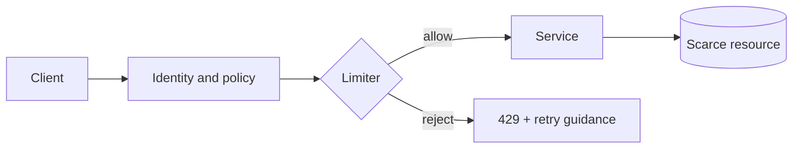

# Chapter 1 — What Rate Limiting Really Does

## Learning objectives

- Separate rate limiting from concurrency limiting, quotas, and backpressure.
- Turn vague requirements into an enforceable policy.
- Identify the resource, subject, and time scale being protected.

## The core model

A rate limiter answers:

> May subject **S** spend cost **C** on resource **R** at time **T**?

Those four fields matter more than the algorithm. “100 requests per minute” is incomplete:

- Who: IP, API key, user, tenant, route, or device?
- What resource: login endpoint, database, vendor API, GPU pool?
- What cost: every request equal, or proportional to bytes/tokens/work?
- What semantics: smooth 1.67 RPS, or a burst of 100 followed by silence?



## Related controls

| Control | Bounds | Typical purpose |
|---|---|---|
| Rate limit | Starts or cost per time | Fairness, abuse, spend |
| Concurrency limit | In-flight work | Protect threads, connections, GPUs |
| Quota | Total use over a long period | Plans and budgets |
| Timeout | Duration of one operation | Stop stale work |
| Queue | Admission delay | Absorb short bursts |
| Circuit breaker | Calls to a failing dependency | Prevent failure amplification |

A 10 RPS limit does not protect a service if each request takes 60 seconds: concurrency could approach 600. Conversely, a concurrency limit alone lets a fast caller consume every newly freed slot.

## Requirement worksheet

Before choosing an algorithm, write:

```text
Protected resource: primary database write capacity
Subject: tenant ID from authenticated token
Cost: 1 unit per ordinary write, 10 per bulk write
Sustained allowance: 50 units/second
Burst allowance: 100 units
Long quota: 2,000,000 units/day
On policy rejection: HTTP 429
If limiter store fails: allow low-risk reads; reject writes
```

## A first mental implementation

```text
key = tenant_id + ":" + route_group
policy = policy_for(tenant_id)
cost = estimate_cost(request)

if limiter.try_consume(key, cost, now, policy):
    forward(request)
else:
    return 429 with retry metadata
```

The limiter must use trusted identity. A caller-controlled `X-User-Id` header is not a safe key unless a trusted gateway overwrites it.

## Common traps

1. **Global-only limit:** one noisy tenant can starve everyone.
2. **IP-only identity:** NAT groups unrelated users; attackers rotate IPs.
3. **Averages only:** a service surviving 1,000 requests over a minute may still fail when all arrive in one second.
4. **Counting rejected work too late:** enforcing after database access protects nothing.
5. **Retry storms:** responding with 429 but giving clients no retry guidance can synchronize retries.
6. **Security confusion:** rate limiting raises attack cost; it does not replace authentication, authorization, or bot detection.

## Exercise

For a password-login endpoint, a search endpoint, and a report export endpoint, define subject, cost, sustained rate, burst, and failure behavior. Notice that they should not share one policy.

## Checkpoint

You are ready to continue when you can explain why “1,000 requests per minute” does not uniquely describe the traffic a service must survive.
