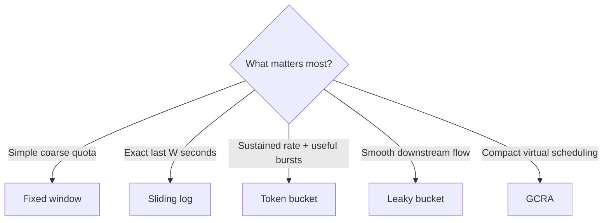

# Chapter 2 — Algorithms and Burst Behavior

## 1. Fixed window counter

Count requests in discrete windows such as `12:00:00–12:00:59`.

```text
window = floor(now / W)
count = increment(key, window)
allow = count <= L
```

It is fast and memory-efficient, but a caller can send `L` requests just before a boundary and `L` just after it. That is up to `2L` in a short interval.

Use it for inexpensive coarse quotas, not when boundary bursts endanger the resource.

## 2. Sliding log

Store every accepted timestamp; remove entries older than `now - W`; accept if fewer than `L` remain.

It is precise but costs up to `O(L)` memory per active key and requires timestamp maintenance. It fits strict, relatively low-volume policies.

## 3. Sliding window counter

Approximate a sliding window by weighting the previous fixed window:

```text
estimated = current_count
          + previous_count * (1 - elapsed_in_current_window / W)
```

It is smoother than a fixed window and cheaper than a log, but it is approximate.

## 4. Token bucket

Tokens refill continuously at rate `r` up to capacity `B`. A request of cost `c` is allowed when at least `c` tokens exist.

```text
tokens = min(B, tokens + (now - last_refill) * r)
if tokens >= cost:
    tokens -= cost
    allow
else:
    reject
```

Token bucket directly expresses sustained rate and permitted burst. If the bucket begins full, the maximum accepted work over interval `t` is:

```text
A(t) <= B + r * t
```

This is often the best default for APIs.

## 5. Leaky bucket and GCRA

A leaky bucket drains at a steady rate. Depending on implementation, excess is queued or rejected. It shapes output more smoothly than token bucket.

GCRA (Generic Cell Rate Algorithm) stores a theoretical arrival time. For interval `T = 1/r`, an accepted request advances that time by `T`. A tolerance value permits bursts. It provides token-bucket-like behavior using compact state.

## Behavior comparison

| Algorithm | Burst handling | State | Precision | Good fit |
|---|---|---:|---|---|
| Fixed window | Boundary spike | Counter/key | Coarse | Cheap quotas |
| Sliding log | Exact window bound | Timestamp/request | Exact | Strict low volume |
| Sliding counter | Smooth approximation | Two counters/key | Approximate | General APIs |
| Token bucket | Explicit burst capacity | Tokens + time/key | Strong | API admission |
| Leaky bucket | Smooth/queued output | Level + time/key | Strong | Traffic shaping |
| GCRA | Configurable tolerance | One time/key | Strong | Distributed/API limits |

## Visual intuition



## Worked example

A token bucket has `r = 10 requests/s` and `B = 30`.

- After being idle, 30 requests can pass immediately.
- After that burst, a new token arrives every 100 ms.
- Over 10 seconds from a full bucket, at most `30 + 10×10 = 130` requests pass.
- A request costing 5 consumes five tokens.

The bucket is not “30 requests per second.” Capacity controls burst; refill controls sustained throughput.

## Exercise

Sketch accepted traffic for `L=60, W=60s` using fixed window, then for token bucket `r=1/s, B=10`. Ask which better matches a human clicking normally but occasionally opening several tabs.
