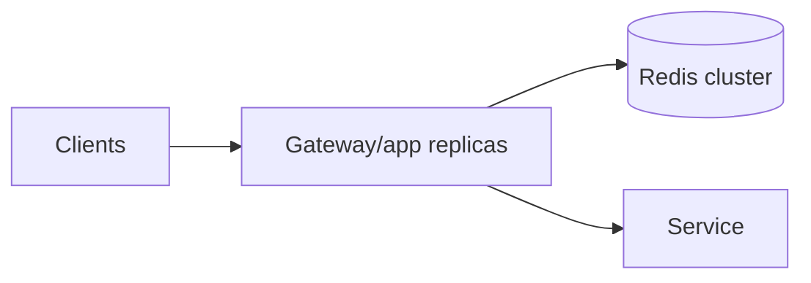

# Chapter 6 — Distributed Rate Limiting

With `N` replicas, independent local buckets can admit approximately `N × B` burst and `N × r` sustained traffic. A distributed design coordinates state.

## Option A: Central atomic store



Redis is common because a Lua script can refill and consume atomically.

## Token bucket Lua script

The following conceptual script uses Redis server time to reduce client-clock disagreement:

```lua
-- KEYS[1] bucket hash
-- ARGV: capacity, refill_per_ms, cost, ttl_ms
local nowParts = redis.call("TIME")
local now = nowParts[1] * 1000 + math.floor(nowParts[2] / 1000)

local values = redis.call("HMGET", KEYS[1], "tokens", "updated_at")
local capacity = tonumber(ARGV[1])
local rate = tonumber(ARGV[2])
local cost = tonumber(ARGV[3])
local ttl = tonumber(ARGV[4])
local tokens = tonumber(values[1]) or capacity
local updated = tonumber(values[2]) or now

local elapsed = math.max(0, now - updated)
tokens = math.min(capacity, tokens + elapsed * rate)

local allowed = 0
local retry_ms = 0
if tokens >= cost then
  tokens = tokens - cost
  allowed = 1
else
  retry_ms = math.ceil((cost - tokens) / rate)
end

redis.call("HSET", KEYS[1], "tokens", tokens, "updated_at", now)
redis.call("PEXPIRE", KEYS[1], ttl)
return { allowed, math.floor(tokens), retry_ms }
```

Production cautions:

- Handle `rate=0` without division by zero.
- Use key hash tags when multiple related keys must share a Redis Cluster slot.
- Choose TTL long enough for a full idle refill, plus margin: at least `B/r`.
- Numeric precision and units must be deliberate.
- Load and invoke scripts safely for your Redis client/version.

## Option B: Local leased tokens

A central coordinator leases chunks of allowance to each instance. Requests consume locally, reducing network latency.

Tradeoff: unused leases reduce utilization; failures may strand tokens; a partitioned instance may keep spending its lease. Overshoot can be bounded by total outstanding leases.

## Option C: Partition ownership

Consistently hash each subject to an owner that serializes decisions. This avoids a central call on every request but needs rebalancing and hot-key handling.

## Multi-region choices

| Design | Latency | Global precision | Availability |
|---|---:|---:|---:|
| One global store | High cross-region | Strong | Store/network dependent |
| Regional independent buckets | Low | Weak; multiplies allowance | High |
| Split global budget by region | Low | Bounded | Capacity may be stranded |
| Asynchronous usage merge | Low | Eventual/overshoot | High |
| Home region per tenant | Medium for remote calls | Strong per tenant | Routing dependent |

There is no universal winner. Billing-grade quota often favors stronger coordination; overload protection usually favors low-latency local decisions.

## Failure policy

- **Fail open:** continue when limiter is unavailable. Good for availability; bad for scarce resources and abuse.
- **Fail closed:** reject. Protects resource; limiter failure becomes an outage.
- **Fallback:** use a conservative local bucket, cached policy, or shed only expensive operations.

Choose per resource, not globally. Reads may fail open while GPU jobs fail closed or use a small emergency budget.

## Lab

Implement the Lua script behind two application replicas. Kill Redis during a load test and verify that the documented fallback—not an accidental timeout cascade—occurs.
