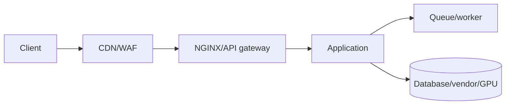
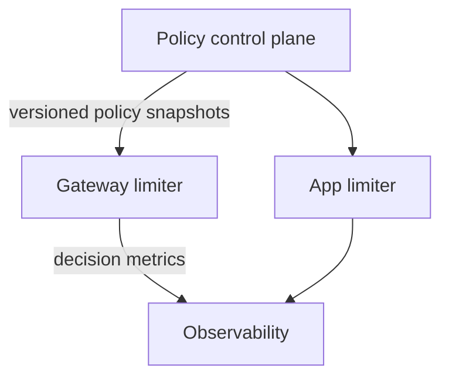

# Chapter 7 — Where to Enforce and How to Compose

## Enforcement locations

Each layer sees different information:

| Layer | Knows | Best at | Limitation |
|---|---|---|---|
| CDN/WAF | IP, geography, basic identity | DDoS/obvious abuse | Little business context |
| NGINX/gateway | Route, verified token claims | Early per-route/tenant limits | Complex cost can be awkward |
| Application | User, plan, operation cost | Business fairness and quotas | Rejection occurs later |
| Queue/worker | Backlog, job cost, worker capacity | Admission and scheduling | HTTP work may already be accepted |
| Dependency wrapper | Downstream health/budget | Vendor and DB protection | Does not protect upstream service |

## Defense in depth

A mature design often uses:

1. Edge per-IP abuse limit.
2. Gateway tenant/route token bucket.
3. Application long-term quota and weighted operation cost.
4. Concurrency limiter around the scarce dependency.
5. Queue size bound and backpressure.

Do not copy the same number into every layer. Each policy should correspond to a resource and purpose.

## Control-plane and data-plane split

The control plane manages plans, overrides, rollout, validation, and audit. The data plane must make fast decisions from cached, validated policies.

If policy delivery fails, continue using the last known good version for a bounded time. Avoid querying a policy database on every request.

## Queue or reject?

Queue when:

- work remains valuable after a delay;
- callers accept asynchronous completion;
- the queue has a strict bound and deadline;
- scheduling can improve fairness.

Reject when:

- delay would violate the request deadline;
- the queue is full;
- retries can be safely delayed to the client;
- accepting creates an obligation you cannot fulfill.

An unbounded queue is not resilience; it converts overload into memory growth and extreme latency.

## Example architecture

For report generation:

- NGINX: 20 requests/minute per authenticated tenant.
- Application: monthly plan quota, weighted by report complexity.
- Queue: maximum 1,000 jobs, per-tenant fair scheduling.
- Worker pool: concurrency based on database and CPU capacity.
- Object store delivery: signed link when complete.

## Exercise

Draw the layers for a payment API. Mark where an idempotency key is checked, where caller rate is limited, where database concurrency is bounded, and what responds during dependency failure.
