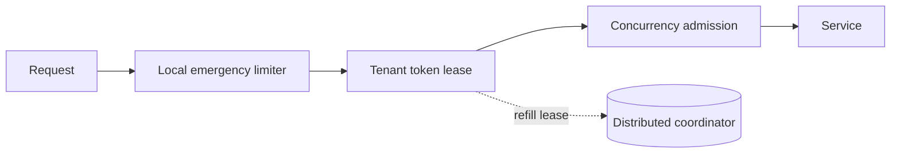

# Chapter 8 — Scale, Consistency, and Failure Tradeoffs

## Start with the invariant

Different goals need different consistency:

- **Safety:** “Never start more than 200 GPU jobs globally.”
- **Fairness:** “Tenants should receive roughly their paid shares.”
- **Billing:** “Monthly usage must be accurately recorded.”
- **Abuse defense:** “Make credential stuffing expensive.”

Strong consistency is valuable for hard safety and money, but costs latency and availability. Approximation is often acceptable for traffic shaping.

## Architectural decision matrix

| Choice | Prefer when | Pay with |
|---|---|---|
| Local limiter | Single instance or approximate per-instance protection | Aggregate overshoot |
| Central Redis | Low-latency network and strong per-key decisions | Dependency and hot keys |
| Token leases | Very high QPS | Bounded overshoot and stranded capacity |
| Regional budgets | Multi-region availability | Rebalancing and uneven demand |
| Strict global service | Hard invariant | Cross-region latency and reduced availability |
| Gateway enforcement | Early rejection | Less business context |
| Application enforcement | Rich policy/cost | More application load |

## Hot keys

A global key sends every decision to one shard. Mitigations include:

- local pre-limits before the global limit;
- token leasing;
- sharded counters with bounded approximation;
- hierarchical limits;
- separating admission safety from accurate asynchronous accounting.

Simply adding Redis shards does not split one hot key.

## Cardinality and memory

Attackers can generate unlimited apparent identities. Bound state with:

- TTL based on refill/window duration;
- authenticated keys when possible;
- admission filters for new keys;
- maximum key length and normalized dimensions;
- local probabilistic sketches for detection;
- aggregated anonymous buckets.

## Clock choices

Local monotonic clocks work well for in-process elapsed time. Wall clocks can jump. In a centralized script, server time keeps decisions on one clock. In multi-region eventual designs, tolerate skew explicitly.

## Exactness budget

Ask how much overshoot is acceptable. If at most `E` excess units are safe and `N` instances lease tokens, size each outstanding lease so:

```text
N × lease_size <= E
```

This turns “eventual consistency is risky” into an explicit bound.

## Hybrid reference design



- Local emergency limit reacts without network dependency.
- Leases handle high QPS.
- Concurrency admission protects real in-flight capacity.
- Asynchronous usage events provide durable billing records.

## Decision exercise

Choose designs for:

1. A public image CDN.
2. A bank transfer endpoint.
3. A globally deployed chat application.
4. A GPU image-generation service.

For each, state the invariant, acceptable overshoot, latency budget, region model, and fail-open/closed behavior.
