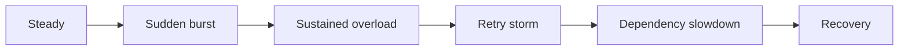

# Chapter 10 — Testing, Observability, and Operations

## Test behavior, not implementation

Deterministic unit tests should inject a fake clock:

1. Full bucket accepts exactly `B`.
2. Next request rejects.
3. Advancing by `1/r` restores one token.
4. Long idle time never exceeds capacity.
5. A backward clock does not create tokens.
6. Weighted costs consume the right amount.
7. Retry time rounds safely.

Property-style invariants:

```text
tokens never < 0
tokens never > capacity
accepted cost over t never > initial_tokens + r × t
```

## Distributed tests

Run concurrent callers against multiple replicas and verify aggregate behavior. Inject:

- Redis latency and timeout;
- network partition;
- replica restart;
- clock skew where relevant;
- hot-key load;
- policy update during traffic;
- regional capacity exhaustion.

## Load profiles



The recovery phase matters: a full queue and synchronized retries can keep a service unhealthy after the original burst ends.

## Metrics

Track by low-cardinality policy and route—not raw user ID:

- allowed and rejected decisions;
- rejection reason/policy;
- limiter decision latency;
- remaining-capacity distribution;
- Redis errors and timeouts;
- local fallback activations;
- in-flight work and queue depth;
- upstream latency/error;
- estimated allowed and rejected cost.

High-cardinality subject IDs belong in sampled, access-controlled logs or traces.

## Alerts

Avoid alerting merely because 429 exists; policy enforcement may be healthy. Alert on:

- a sudden rejection ratio change;
- sustained legitimate-customer rejection;
- limiter-store errors;
- decision latency consuming request budget;
- fallback mode duration;
- protected resource saturation despite limiting;
- sharp utilization drop suggesting an overly strict policy.

## Rollout

1. Shadow mode: calculate decisions but do not reject.
2. Compare estimated demand with capacity and customer expectations.
3. Enforce for internal/test tenants.
4. Gradually expand by policy or traffic percentage.
5. Maintain an audited emergency override with expiry.
6. Review rejection samples and protected-resource health.

Shadow mode must not mutate the same counters as enforcement in a way that changes results.

## Runbook questions

- Is rejection isolated to one policy, route, tenant class, or region?
- Did traffic rise, policy change, or capacity fall?
- Is the limiter healthy or in fallback?
- Are clients honoring `Retry-After`?
- Would increasing the limit overload the protected resource?
- Is the emergency change versioned, observable, and automatically expiring?

## Lab

Create a load test with steady, burst, overload, and recovery phases. Graph allowed RPS, rejected RPS, p99 latency, in-flight work, and dependency saturation on one timeline.
