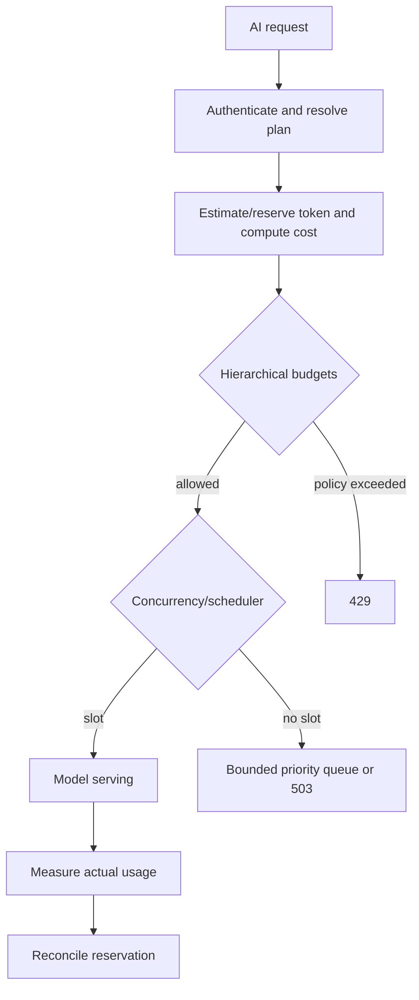

# Chapter 11 — How AI and LLM Rate Limits Are Done

AI rate limiting is multi-dimensional because one request can consume very different amounts of scarce work.

## Why requests are not equal

An LLM request may vary by:

- input tokens;
- maximum and actual output tokens;
- model size and serving tier;
- context-cache usage;
- streaming duration;
- batch versus interactive priority;
- tool calls and multimodal inputs;
- GPU memory and compute time.

Therefore providers commonly expose or internally enforce combinations such as requests/minute, input or total tokens/minute, requests/day, concurrent requests, and model-specific capacity. Exact provider policies vary and change.

## Admission model



## Multiple simultaneous buckets

A request might need all of:

```text
tenant request bucket
tenant token bucket
user anti-abuse bucket
model/deployment capacity bucket
organization daily spend quota
concurrency slot
```

Example:

```text
request cost bucket: 1 request
token reservation: input_tokens + max_output_tokens
compute estimate: reserved_tokens × model_weight
```

If output stops early, refund or reconcile unused reservation. Reserving only input tokens permits callers to request huge outputs and overload capacity. Charging only the maximum forever unfairly penalizes short completions.

## Prompt and completion accounting

```js
async function admitAiRequest(req, budgets) {
  const input = countTokens(req.prompt, req.model);
  const outputReservation = Math.min(req.maxTokens, policyMax(req.model));
  const modelWeight = weightFor(req.model);

  const reservation = {
    requests: 1,
    tokens: input + outputReservation,
    computeUnits: (input + outputReservation) * modelWeight,
  };

  const lease = await budgets.reserveAtomically(req.tenantId, reservation);
  if (!lease.allowed) return { status: 429, retryAfterMs: lease.retryAfterMs };

  try {
    const result = await runModelWithConcurrencyLimit(req);
    await lease.reconcile({
      tokens: input + result.outputTokens,
      computeUnits: (input + result.outputTokens) * modelWeight,
    });
    return { status: 200, result };
  } catch (error) {
    await lease.releaseAccordingToPolicy(error);
    throw error;
  }
}
```

“Atomically” matters: consuming the request bucket and then failing the token bucket can charge partial state. At scale, systems may accept bounded approximation instead, but must define it.

## Streaming

Streaming holds connections and serving slots. Controls can include:

- max concurrent streams per tenant;
- maximum output tokens and wall-clock duration;
- idle-stream timeout;
- periodic usage charging;
- cancellation propagation when the client disconnects.

A request-per-minute limit alone does not control long-lived streams.

## Fair scheduling

When GPUs are saturated, a scheduler may use:

- per-tenant queues;
- weighted fair queuing based on plan;
- separate interactive and batch pools;
- earliest-deadline or priority scheduling;
- maximum queue age;
- reserved capacity for critical workloads.

Rate limiting decides eligibility; scheduling decides order. Mixing them into one opaque counter makes fairness hard to explain.

## Adaptive limiting

Static policies enforce plans, while dynamic admission can react to:

- queue depth;
- time-to-first-token;
- GPU utilization/memory;
- model replica health;
- cache hit rate;
- predicted request cost.

Use guardrails: gradual changes, minimum capacity, stable signals, and versioned decisions. A feedback controller that reacts too quickly can oscillate.

## 429 versus 503 for AI

- Use **429** when this caller exceeded a known request/token/plan policy.
- Use **503** when shared serving capacity is temporarily unavailable despite the caller being within policy.

This distinction helps clients decide whether to slow their own usage, retry later, or choose another deployment.

## Privacy and abuse

Do not log prompts merely to explain rate decisions. Decision logs usually need subject hash, model, policy version, estimated/actual units, outcome, and request ID. Abuse classification can complement rate limits but needs separate privacy and appeal considerations.

## Exercise

Design limits for a chat product with a small model, a large model, streaming, free/pro tiers, and batch summarization. Explain reservation, reconciliation, concurrency, and scheduling separately.
