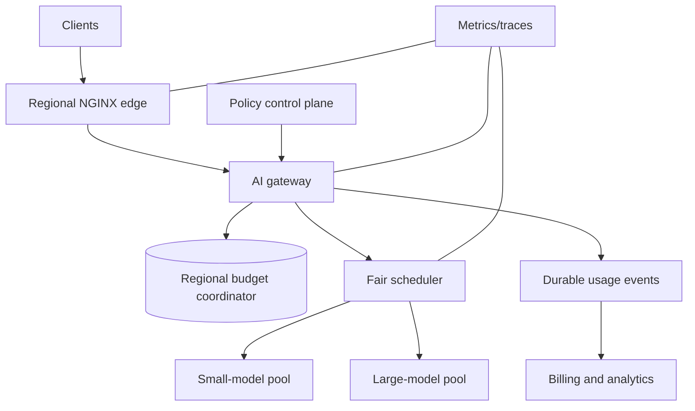

# Chapter 12 — Capstone: Multi-Tenant AI Gateway

## Scenario

Build an AI gateway deployed in three regions. It serves free and pro tenants, two model classes, streaming chat, and batch jobs.

Constraints:

- interactive requests need low admission latency;
- GPU capacity is scarce;
- pro tenants receive higher weight, not unlimited capacity;
- monthly usage must be auditable;
- a region or limiter dependency may fail;
- output length is unknown at admission.

## Target architecture



## Required policies

1. Edge anonymous/IP abuse limit.
2. Tenant requests/minute token bucket.
3. Tenant input-plus-reserved-output token bucket.
4. Model-weighted compute budget.
5. Tenant concurrent-stream limit.
6. Global/regional model-pool admission.
7. Monthly durable quota.
8. Bounded weighted-fair queues for interactive and batch work.

## Design choices to document

Create an architecture decision record for each:

- Why regional budgets or a global coordinator?
- Maximum overshoot during partition.
- How capacity is rebalanced between regions.
- Whether each failure fails open, closed, or falls back locally.
- How token reservations are reconciled.
- How cancelled streams are charged.
- What returns 429 versus 503.
- How policy changes roll out and roll back.

## Suggested implementation milestones

### Milestone 1 — Single process

- Node.js or Spring Boot gateway.
- In-memory request, token, and concurrency limits.
- Fake model endpoint with controllable latency.
- Deterministic clock tests.

### Milestone 2 — Edge and distributed state

- NGINX per-IP limit.
- Redis atomic reservation for tenant buckets.
- TTL and cardinality protection.
- Two gateway replicas under one load generator.

### Milestone 3 — AI accounting

- Count input tokens using the model’s tokenizer.
- Reserve bounded output tokens.
- Reconcile actual completion tokens.
- Cancel generation and release resources on disconnect.

### Milestone 4 — Reliability

- Shadow policy rollout.
- Redis timeout fallback.
- Region partition simulation.
- Retry storm and slow-GPU load profiles.
- Dashboards and alerts.

## Acceptance tests

- A free tenant cannot starve a pro tenant.
- A pro tenant cannot exceed hard shared GPU safety limits.
- Aggregate accepted cost respects the documented error envelope.
- Long streams are bounded by concurrency and duration.
- Redis failure produces the designed fallback within the latency budget.
- Duplicate/retried requests do not corrupt durable accounting.
- Policy version appears in every decision trace.
- Recovery does not create a synchronized retry avalanche.

## Final architecture review template

```text
Protected resources:
Subjects and trusted identity source:
Cost dimensions and units:
Algorithms and parameters:
Burst envelope:
Concurrency and queue bounds:
Consistency and maximum overshoot:
Multi-region allocation:
Dependency failure behavior:
HTTP/client retry contract:
Metrics, logs, and privacy:
Load-test evidence:
Emergency override and expiry:
Known limitations:
```

## Mastery questions

1. Why is a token bucket often better than a fixed window for interactive APIs?
2. When is approximate distributed enforcement safer than strict global coordination?
3. How does service latency turn a safe request rate into unsafe concurrency?
4. Why must an AI gateway reserve output cost before generation?
5. Which invariant belongs to rate limiting, which to concurrency limiting, and which to durable accounting?

If you can defend the capstone’s choices under burst, dependency slowdown, regional failure, and adversarial traffic, you have moved from implementing counters to engineering admission control.
